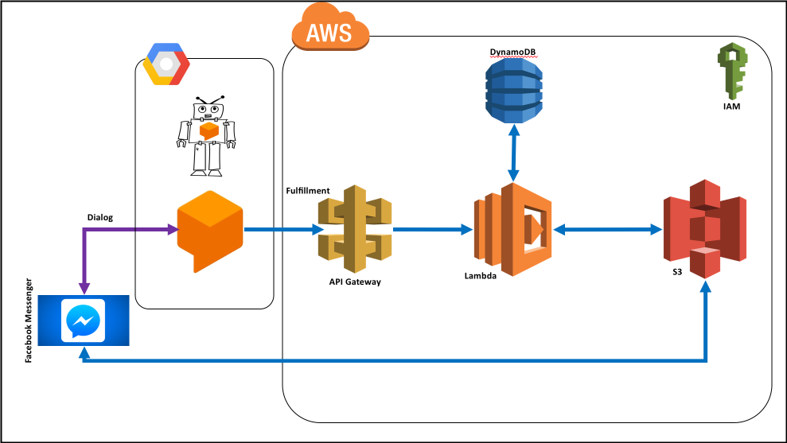

# Use input and output contexts in Dialogflow

Often you need to retrieve information from your database or a service
in order to provide a full user response. E.g. if you have to ask your
service the parcel's estimated arrival time. For this use case
Dialogflow allows webhooks.

AWS Lambda services are perfect to construct a scalable and cost
efficient backend infrastructure.

But of cause you can user every public rest service as you like.



## Task:

Enhance the chatbot, that it is able to request the status dynamically
by calling a webhook.

## Steps with existing webhook:

1. Add fullfillmet service with Webhoock URL: https://oiru9dv2fi.execute-api.eu-central-1.amazonaws.com/latest

2. Add Event to Intent: fill_parcel_status

2. The PrcelID entity must be named: @sys.number:parcelId

3. Add as default Value to ParcelID: $parcelId

4. Add an additional status value with value #fill_parcel_status.status

## Steps with developed Webhook:

1. Deploy a new webhook! Replace the `<your_prefix>` tag at the
   `package.json.template` and rename the file to `package.json`. Deploy
   the lambda by typing `npm run create`. This time you can omit `npm
   run configure`, because we don't wire the lambda up with Facebook,
   but with Dialogflow. Study the provided example code for this task!

2. Add a Fulfillment at Dialogflow and enter the URL of the lambda you
   just created. See `npm run create` console output for URL. Choose
   "Enable for all Domains".

3. Switch to the intent you created previously and enable "Use webhook".

4. Use the user's query parameters, e.g. parcel_id, to read status from
   DynamoDB and return it. Find the parameters at `const parameters =
   objectPath.get(req, 'body.queryResult.parameters')`. See TODO at
   `index.js` for more detailed task description.

5. Resolve with an event to Dialogflow!
``` 
{
    followupEvent: {
        data: {
            parcel_id: parameters.parcel_id,
            status: '<status>'
        },
        name: 'fill_parcel_status'
    }
}
```

6. Listen to event inside your intent, by creating an event at
   "Events"at your Parcel Status intent, name it `fill_parcel_status`.

7. Add a new parameter "status" and define `#fill_parcel_status.status`
   as value. Also define `#fill_parcel_status.parcel_id` as default
   value for the parameter "parcel_id".

8. Use returned status in bot answer by defining "The parcel with the id
   $parcel_id will arrive $status!"
