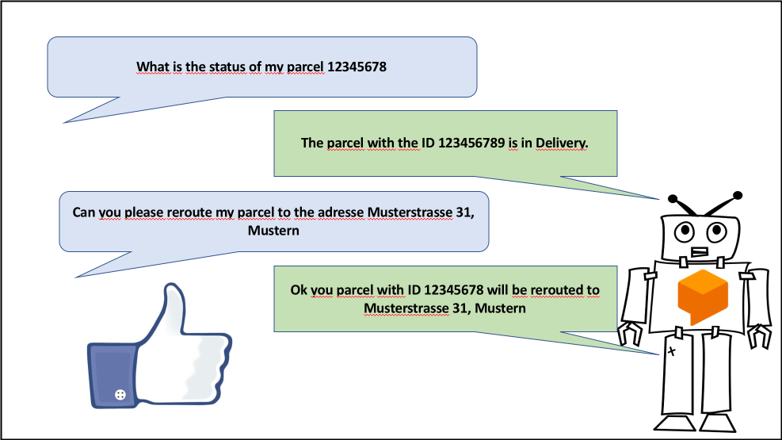

# Use input and output contexts in Dialogflow

Some intents need a certain context to be valid. E.g. if the user asks
for a rerouting of a parcel you could require a context containing
information about the parcel for the intent to be a valid possibility.
You would not expect a user to ask for rerouting if he did not ask for
the current status before.

## task:

Enhance the chatbot that the user will be able to reroute the parcel to
a new destination. The user shall not be forced to add the parcel ID
again but should store the parcelID as Context information.

### Optional 1:

Change both intents that they ask if not pracle ID is in the context or
use the parcel ID in the existing context of already stored.

### Optional 2:

Find a way to destory the context or update the context with a new parcel ID
in the context.

## Steps:

1. Add outgoing context at "Parcel Status" intent, name it "parcel" and
   leave the default 5 minute lifespan as it is.

2. Create a new intent "Reroute Parcel" and require the parcel context
   you just created as input context.

3. Define a location parameter, make it required and choose
   `@sys.location` as entity. See the
   [Dialogflow documentation](https://dialogflow.com/docs/reference/system-entities)
   for more information about system entities.

4. Define a response like "Alright, we will reroute your parcel with the
   id #parcel.parcel_id to $location!", note that you can access
   `#parcel.parcel_id` from your input context.
